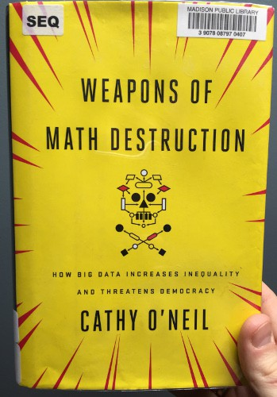

{: .align-right}

I recently read [Weapons of Math Destruction](https://amzn.to/2CUTrcb) by Cathy O'Niel, after seeing it recommended several times. The book is an easy read and a thought-provoking exploration of the ethical implications of big data algorithms.

O'Neil argues that opaque predictive algorithms can codify bias, racism, and inequality into automated systems. Through numerous examples in educational, financial, and judicial systems, she illustrates how the humans who design algorithms can unintentionally imbue them with their own prejudices.

To solve these issues, the book proposes that predictive algorithms should
* be **transparent**: the inner workings should be easy to explain and to understand, especially to those people affected by the algorithms.
* have **feedback loops**: the algorithms must account for new data as it becomes available, and be continually adjusted to account for anomalies and changes in data trends.
* be **taken with a grain of salt**: the algorithms should be viewed as only one tool among many to evaluate specific individuals.

Toward the end of the book, O'Neil mentions an intruiging idea I've heard elsewhere: that [data scientists should take a "Hyppocratic Oath."](https://www.wired.com/story/should-data-scientists-adhere-to-a-hippocratic-oath/) Much like physicians of long ago who took an oath that included statements like "First of all, do no harm," some data scientists today are creating a code of ethics to govern how data algorithms should be built and used.

[Data ethics](https://en.wikipedia.org/wiki/Big_data_ethics) is an emerging field which I find fascinating. It lies at the crossroads of *hard science* (data, algorithms, mathematics, logic) and *soft science* (philosophy, ethics, psychology, sociology). Data science and predictive algorithms are powerful tools, to be sure. But, like any tool, they must be used responsibly.

Many people try to stop smoking a hundred times and fail. Predictive algorithms would therefore reasonably assign a very low probability of success to the next attempt to quit. But free will can, and occasionally does, enable someone to quit on that hundred-and-first try. We must never forget the human capacity to change - to do so would be unmerciful and unjust.

*Weapons of Math Destruction* is an enjoyable and eye-opening view of the dark side of data algorithms.
