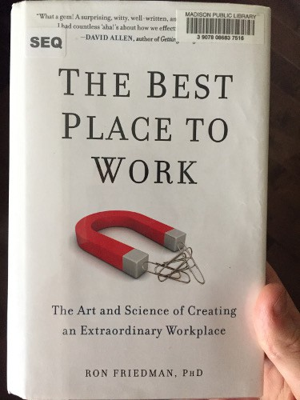

{: .align-right}

A few weeks ago, I was reading Ron Friedman's [The Best Place to Work](https://amzn.to/2Dg1hO4) at a clinic when my doctor walked in and quipped "I see you are reading a work of fiction." This admittedly amusing comment reflects the fact that many people don't enjoy their work, their colleagues, or their workplace.

Although it's [improved slightly](https://news.gallup.com/poll/241649/employee-engagement-rise.aspx) in the last few years, Gallup consistently reports abysmal workforce engagement figures. Only one third of U.S. workers are "engaged," meaning they are involved in, enthusiastic about, and committed to their work and workplace. Slightly over half of workers are "not engaged" (usually show up to work and do the minimum required but will quickly leave their company for a slightly better offer), and the rest - about 15% - are "actively disengaged" (those who are miserable at work).

How can we build happier, better workplaces? The Best Place to Work summarizes current psychological research on the topic and recommends best practices for creating a better work environment. Some of the most salient tips include:
* **Reward attempts, not outcomes**: people who try often will fail often, but they will also succeed more often than if they had not tried.
* **Work environment affects creativity**: quiet, minimalist spaces can be great for work that requires focus and concentration, but sometimes work that requires creative thinking may be better done in a busy environment with the distractions of noise and activity.
* **The best decisions are reached unconsciously**: we often experience breakthroughs in our work when we go for a walk or take a shower.
* **Eat well and take a nap**: exercise, diet, and sleep impact our decision-making.
* **Practice gratitude**: taking time each day to reflect on things you're grateful for will make you happier and a better coworker.
* **Team building**: groups of people become more tight-knit when they share experiences and confidences. Encourage socializing, including deeper connections, to make a team stronger. Onboard new employees with an eye toward friendship.
* **New team members**: leverage your existing employees’ networks to find new team members, and interview them based on ability to do the job by assigning a test project.
* **Foster healthy pride in your company** by creating a grand purpose or narrative, emphasizing how your company is distinct from others, making a commitment to the greater good, and valuing the contributions of every team member.

I feel very fortunate to work at [Ballotpedia](https://ballotpedia.org/), where my coworkers are excellent and the mission is very compelling. [The Best Place to Work](https://amzn.to/2Dg1hO4) is a good reminder of practical ways to keep making our workplace even better.
