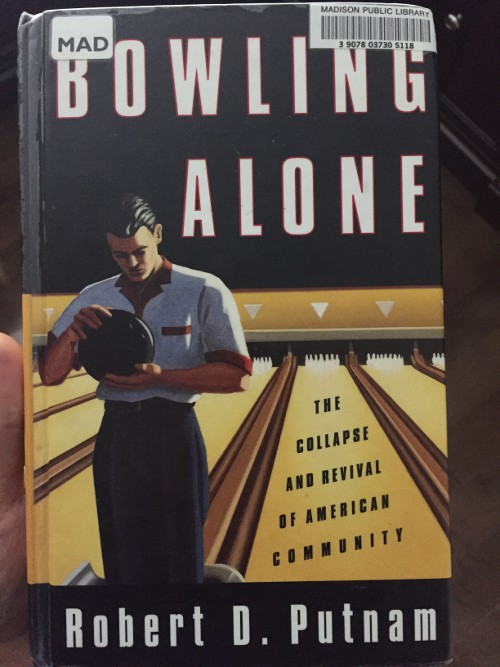

{: .align-right}

I've had Bowling Alone on my reading list since attending a [servant leadership](https://en.wikipedia.org/wiki/Servant_leadership) conference back in the summer of 2018 at [Viterbo University](https://www4.viterbo.edu/), when one of the speakers mentioned it in his presentation. So I was happy when I was finally able to check it out from the library!

In [Bowling Alone: The Collapse and Revival of American Community](https://www.amazon.com/Bowling-Alone-Collapse-American-Community/dp/B01N94FW0P/), author Robert Putnam presents an avalanche of evidence that Americans are becoming less connected to each other in communities. This trend began shortly after the 1960s and continues to this day. People are now less involved with church, local politics, clubs, service organizations, and social groups than they used to be. They also have fewer close friends and entertain less frequently.

Putnam examines numerous possible reasons for this disengagement, and concludes that no single cause explains the change. Rather, a combination of changes in family structure (including the increased participation of women in the workforce), increased consumption of electronic entertainment (most notably television-watching), and generational change (the post-WWII generation, which was remarkably socially *engaged*, is fading away) as the primary causes of the phenomenon - but he notes that all of these factors together only explain part of the observed decline in social engagement.

The term Putnam uses repeatedly for this connectedness, or lack thereof, is *social capital* - the trust, reciprocity, information, and cooperation associated with social networks. He compares social capital to other forms of capital including human capital (the capacities of individuals, inherited and acquired through education and training) and financial capital (economic resources measured in terms of money).

At the end of the book, Putnam calls for "social entrepreneurs" to help rebuild social capital in American society by intentionally working to increase connectedness in families, workplaces, neighborhoods, churches, entertainment mediums, cultural institutions, and local governments.

My one complaint about Bowling Alone is that Putnam doesn't really explain *how* we can best rebuild social capital... and I think the reason is that he doesn't exactly know. There doesn't seem to be one "easy fix" for this problem, but rather a host of creative solutions for individual places and communities.

What Putnam calls social disengagement seems to me to be related to selfishness. By nature, we humans are selfish animals. We are firstly concerned with out own wants and needs. It takes virtue to rise out of selfishness and prioritize the needs of others. My view is that widespread personal pursuit of [virtue](https://en.wikipedia.org/wiki/Virtue) will be the first step toward rebuilding social connectedness, but that thought might deserve its own blog post. :)

After reading Bowling Alone, I also read [Better Together: Restoring the American Community](https://www.amazon.com/Better-Together-Restoring-American-Community/dp/0743235479/). Written by Putnam and co-author Lewis Feldstein, Better Together highlights the stories of about a dozen communities around the United States where, in their view, social capital is being redeveloped. These stories provide some insight into how specific communities are tackling the decline in social capital.

Overall, *Bowling Alone* is an interesting, if somewhat somber, look at the state of American society. The depth of research done for the book is astounding. It sheds light on an important social problem that has developed in America over the last half-century.
