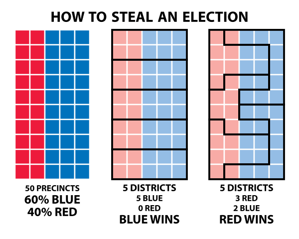
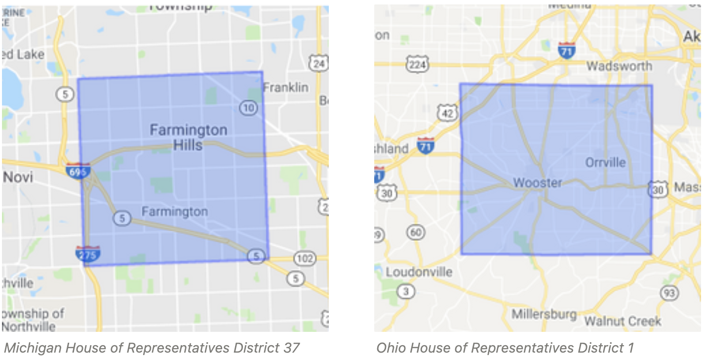
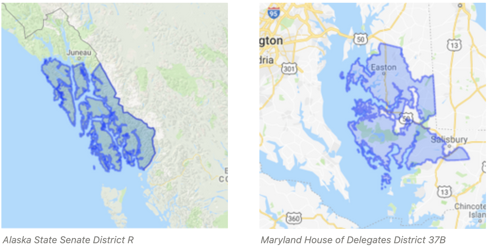
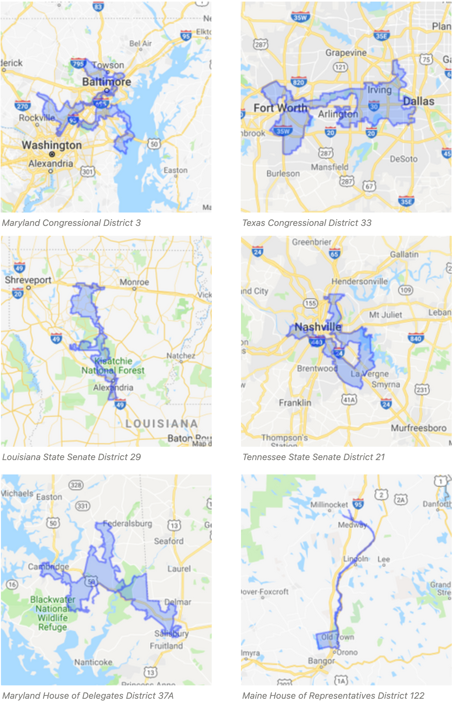
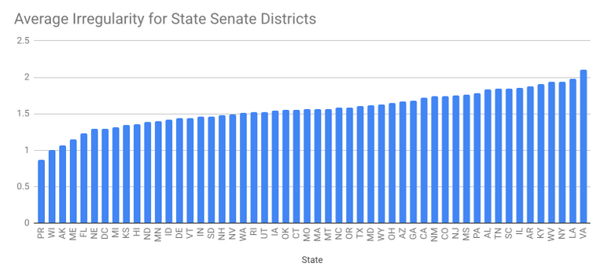
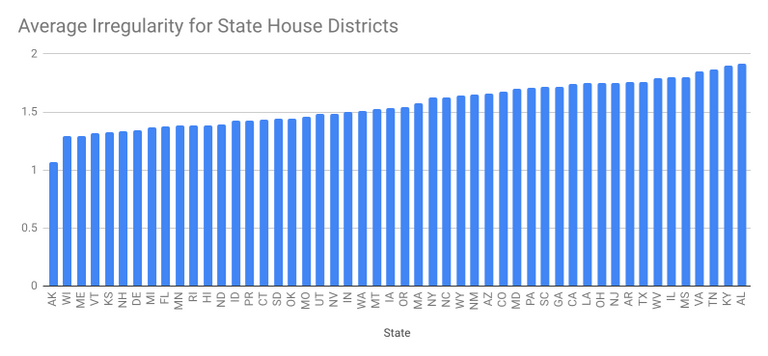
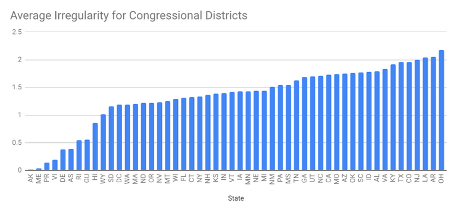

*Posted December 11, 2018*

[According to the U.S. Constitution](https://history.house.gov/Institution/Origins-Development/Proportional-Representation/), congressional districts are supposed to provide [proportional representation](https://en.wikipedia.org/wiki/Proportional_representation). Practically speaking, that means that districts should be [contiguous](https://en.wikipedia.org/wiki/Geographic_contiguity), contain roughly the same number of inhabitants, and (based on the Voting Rights Act of 1965) roughly the same racial makeup. State legislative districts are also drawn to similar standards.

State Legislatures redraw district boundaries every 10 years (after the census) to relect population changes. But due to the partisan nature of legislatures, redistricting often leads to [gerrymandering](https://ballotpedia.org/Gerrymandering) - the drawing of convoluted boundaries to achieve partisan control - to consolidate control for one party.

Gerrymandering is unduly complex and can be unfair, which is why [most people dislike it](https://www.fairvote.org/new_poll_everybody_hates_gerrymandering).

I wondered if there was a way to detect and possibly quantify gerrymandered district boundaries by considering boundary regularity. So I built a database of districts and boundary information in [PostGIS](https://postgis.net/) from [Census Bureau data](https://www.census.gov/geo/maps-data/data/cbf/cbf_sld.html) which I could query.

### District Irregularity Index
I wanted to find a mathematical way to compare how gerrymandered two districts might be. Note that [irregular district boundaries do not necessarily imply gerrymandering](https://sites.duke.edu/quantifyinggerrymandering/2018/01/30/gerrymandering-is-not-about-oddly-shaped-districts/). But on the other hand, gerrymandered boundaries usually appear more irregular. So let's try to define a metric that can be calculated for any geographic boundary - we'll call it the *District Irregularity Index*.

One way to detect irregular districts might be to compare the perimeter of a district to its area. The idea here is that a "simple" district boundary, such as a square, would have a much lower perimeter-to-area ratio than a complex shape like a 5-point star.

The figure above shows a 5-point star that fits inside a square. The star's perimeter is the same as that of the square, but its area is less than one third.

However, one problem with simply dividing the perimeter by the area is that comparing districts identical except in size will not produce an identical irregularity index. The irregularity index for a square with sides of length 10 would be 40 / 100 = 0.4, compared to a square with sides of length 100 which would be 400 / 10000 = 0.04 . We can solve this issue by dividing by the square root of the area. So 40 / sqrt(100) = 4 , and 400 / sqrt(10000) = 4. Finally, if we divide by 4, we get a nice round number 1 for the irregularity index of a square.

Next, I computed the *District Irregularity Index* for a bunch of state legislative districts. I queried for `0.25*ST_Perimeter(boundary)/SQRT(ST_Area(boundary))`. (District boundaries were stored in the PostGIS database as multipolygons in a geography column called *boundary*.) Unsurprisingly, the simplest (most "square") districts - for example, [Michigan House of Representatives District 37](https://housedems.com/greig/district) and [Ohio House of Representatives District 1](http://www.ohiohouse.gov/members/district-map) - scored around 1.

But on the other end of the spectrum, districts like [Alaska State Senate District R](https://www2.census.gov/geo/maps/dc10map/SLD_RefMap/upper/st02_ak/sldu0200r/DC10SLDU0200R_000.pdf) and [Maryland House of Delegates District 37B](https://ballotpedia.org/Maryland_House_of_Delegates_District_37B) scored very high - not because they are gerrymandered, but because they are coastal districts that include many islands. When each coastal island gets its own polygon, the irregularity index can be high for non-gerrymandered districts.

To address this, I added one more term to the formula: divide by the total number of polygons in the boundary. For most land-locked districts, this will be 1, but for districts with complex coastlines, it will help reduce the irregularity index value.

So my final formula is
`DistrictIrregularityIndex(boundary) = 0.25 * ST_Perimeter(boundary) / SQRT(ST_Area(boundary)) / ST_NumGeometries(boundary::geometry)`

Running this query turned up some very interesting districts, including:
* [Maryland's 3rd congressional district](https://en.wikipedia.org/wiki/Maryland%27s_3rd_congressional_district) (known as [America's most Gerrymandered district](https://newrepublic.com/article/109938/marylands-3rd-district-americas-most-gerrymandered-congressional-district))
* [Texas' 33rd congressional district](https://en.wikipedia.org/wiki/Texas%27s_33rd_congressional_district)
* [Louisiana State Senate district 29](http://senate.la.gov/senators/CurrentMaps/29.pdf)
* [Tennessee State Senate district 21](https://ballotpedia.org/Tennessee_State_Senate_District_21)
* [Maryland House of Delegates District 37A](https://ballotpedia.org/Maryland_House_of_Delegates_District_37A)
* [Maine House of Representatives District 122](https://www.maine.gov/sos/cec/elec/apport/statewidehouse.pdf) (quite a gem)

Again, just because these district shapes are irregular doesn't mean they are gerrymandered... but there is a higher likelyhood they might be.

### Alabama Redistricting
In 2012, Alabama redrew its state legislative district boundaries (following the 2010 census). The [Alabama Legislative Black Caucus filed suit against the state](https://ballotpedia.org/Redistricting_in_Alabama#Alabama_Legislative_Black_Caucus_v._Alabama), alleging racial gerrymandering in the new district plan. After a lengthy court battle, a federal court [upheld their claim](https://www.al.com/news/birmingham/index.ssf/2017/01/federal_judges_rule_alabama_mu.html) and ordered the legislature to redraw 3 Senate districts and 9 House of Representatives districts. The districts were redrawn and took effect in 2017.

I looked at the Alabama state legislative districts from pre- and post-2017 redistricting, applying the District Irregularity Index to see if, in fact, the pre-2017 districts were more gerrymandered than after 2017. Here are the findings:

**Alabama state legislative district irregularity**

| Irregularity Index | Avg    | Min    | Max    | Std Dev |
| -----------------  | ------ | ------ | ------ | ------- |
| pre-2017 (Senate)  | 2.0206 | 0.3073 | 3.1935 | 0.5515  |
| pre-2017 (House)   | 2.089  | 0.3671 | 3.4122 | 0.5495  |
| post-2017 (Senate) | 1.8309 | 0.8178 | 2.6336 | 0.4345  |
| post-2017 (House)  | 1.9162 | 0.765  | 3.0254 | 0.4705  |

After the 2017 redrawing, the average district irregularity decreased almost 10% for both the house and senate. Additionally, the most irregular Alabama districts became less so by over 10%. So the metric seems reasonable.

### District Irregularity Analysis
Next, I computed the irregularity index for all congressional and state legislative districts. Full results are available [here](https://docs.google.com/spreadsheets/d/14tIcQGdyLsr6fcOQWpCrNBz7hSF3ZRtTtiUwEnb-_jg/edit?usp=sharing), but I will present some findings below.

The most irregular Senate districts are in Virginia and Louisiana, the least irregular are in Puerto Rico and Wisconsin.

The most irregular House districts are in Alabama and Kentucky, the least irregular are in Alaska and Wisconsin.

For Congressional districts, the graph above is interesting because it has a tail made up of single-district coastal states and territories. Their average irregularity is low because of the division by number of polygons. Among the other states, Wyoming and South Dakota (both nearly-square states with only one congressional district) have low average irregularity, and Ohio and Arkansas have high average irregularity.

[Ohio's congressional districts](https://en.wikipedia.org/wiki/Ohio%27s_congressional_districts) indeed appear very irregular, and are [widely recognized as gerrymandered](https://www.aclu.org/blog/voting-rights/gerrymandering/why-ohios-congressional-map-unconstitutional). In [November 2016](https://en.wikipedia.org/wiki/2016_United_States_presidential_election_in_Ohio#Results_3), 51.69% of Ohio residents voted for the Republican presidential candidate, compared to 43.56% for the Democratic candidate... but Republicans carry 12 of the 16 Congressional districts (75%).

Arkansas, on the other hand, doesn't appear terribly gerrymandered. Its high irregularity index is due to the complex boundary along the Mississippi river on the eastern side of the state.

Interestingly, my home state of Wisconsin, in which [Democrats have accused Republicans of gerrymandering](https://www.jsonline.com/story/news/politics/elections/2018/09/14/democrats-revive-redistricting-lawsuit-block-election-maps-2020/1301898002/), has one of the lowest average irregularities for state legislative districts, and is around the middle of the pack for congressional districts. That doesn't necessarily mean Wisconsin's legislative districts aren't gerrymandered, but other factors could be at play.

### Conclusion
The *District Irregularity Index* alone is not sufficient to accurately identify gerrymandered districts, but it can help focus the search. State legislatures might use something like the irregularity index, along with other metrics, to compare new redistricting plans to past boundaries, and ensure they are not making new districts more gerrymandered than before.

Drawing fair districts is a complex problem which is easy to criticize but hard to get right. Earlier this year, the Supreme Court [declined to hear several cases](https://www.cnn.com/2018/06/18/politics/supreme-court-gerrymandering-decision/index.html) involving partisan gerrymandering - due partly to the difficulty in quantifying the impact of various district boundaries. With those decisions, and no clear way to quantify the extent of partisan gerrymandering, we will likely continue to see and hear more on this controversial topic in years to come.

### Future work
There are a number of possible improvements to the *District Irregularity Index*. One might be to identify boundary segments near bodies of water and reduce how much those segments factor into the perimeter calculation. For example, a district boundary must necessarily be somewhat irregular if it borders a river.

With a relatively good irregularity metric, we could combine other data (like population and demographic data) to create a neutral heuristic for ranking the degree to which potential district boundaries are gerrymandered. Such a heuristic could then be used with an optimization method (such as a genetic algorithm) to automate the creation redistricting plans, and to evaluate them.

### Further reading
* [How to Quantify (and Fight) Gerrymandering](https://www.quantamagazine.org/the-mathematics-behind-gerrymandering-20170404/)
* [Gerrymandering is Not about Oddly Shaped Districts](https://sites.duke.edu/quantifyinggerrymandering/2018/01/30/gerrymandering-is-not-about-oddly-shaped-districts/)
* [Redistricting: Drawing the Line](https://arxiv.org/pdf/1704.03360.pdf)

*Data for this research courtesy of [Ballotpedia](https://ballotpedia.org/).*
{: .notice}
