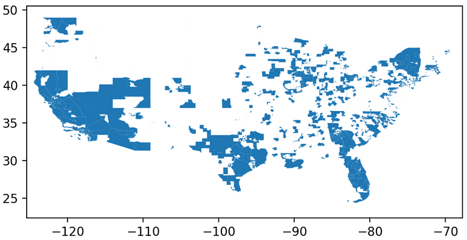
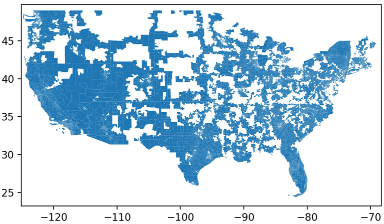
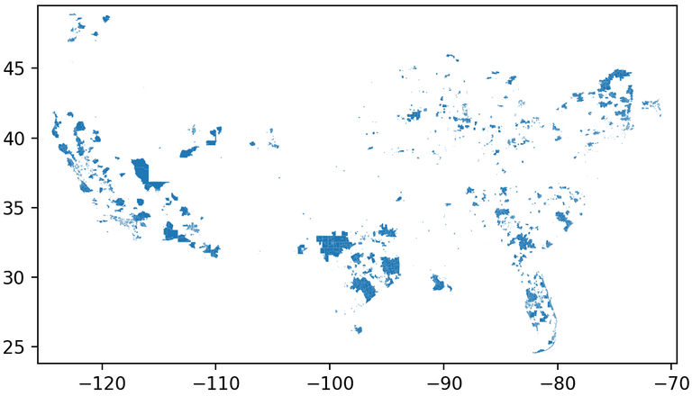

# The Effect of Redistricting

Posted February 13, 2021

Every ten years the [U.S. Census Bureau](https://en.wikipedia.org/wiki/United_States_Census_Bureau) conducts a new census, a process required under [the Constitution](https://en.wikipedia.org/wiki/Constitution_of_the_United_States) which involves surveying every household in the country to obtain updated population figures. Accurate data is important for numerous reasons, most notably for ensuring proper [apportionment](https://en.wikipedia.org/wiki/United_States_congressional_apportionment) of seats in the U.S. House of Representatives.

According to the Constitution, every Representative must represent a roughly-equal number of constituents. As populations grow, die, or move around the country, Congressional district boundaries must be redrawn to maintain accurate representation. This process is called [redistricting](https://en.wikipedia.org/wiki/Redistricting_in_the_United_States).

Recently I was talking with someone about the [imminent](https://en.wikipedia.org/wiki/2020_United_States_redistricting_cycle) redistricting due to the 2020 census and we wondered how many people are actually affected by Congressional redistricting. In other words, what proportion of voting-age Americans will see the Congressional district they live in change?

Of course it's too early to tell for the 2020-cycle redistricting, since the Census Bureau [won't even release new apportionments until the end of April 2021](https://www.npr.org/2021/01/27/961247853/census-numbers-for-dividing-up-house-seats-delayed-until-april-30-bureau-says), but I thought it would be interesting to find out the answer to this question for the 2010-cycle redistricting.

Data science to the rescue!

The Census Bureau provides shapefiles for Congressional districts every year, so I downloaded [the 2010 district boundaries](https://www2.census.gov/geo/tiger/TIGER2010/CD/108/tl_2010_us_cd108.zip) (from before the 2010-cycle redistricting) and [the 2014 boundaries](https://www2.census.gov/geo/tiger/TIGER2014/CD/tl_2014_us_cd114.zip) (after redistricting and most legal challenges to it) and computed the difference between them: areas which changed from one district to another. Here's what that looks like:

It's a fairly large area, but how how many people lived in it? To determine that, I downloaded [the shapefile for the 2010 Census Tracts](http://www2.census.gov/geo/tiger/TIGER2010DP1/Tract_2010Census_DP1.zip), which includes the boundaries of 74,002 census tracts with demographic data for each. One of the demographic data points is the number of people age 16+ living in each Tract in 2010, which is a useful proxy for "voting-age population" since these people would be at least 18 years old (and thus eligible to vote) in the next major election in 2012. (The total 16+ population in the United States was 246,211,542 in 2010.)

Now I just had find the intersection of the above area with the census tracts and total the 16+ population counts. Unfortunately that's not simple, since Congressional district boundaries are different than census tract boundaries. A single census tract might be split across two or more Congressional districts. So I tried three different approximation methods.

### **Overlap**

First, I determined any census tracts that *overlap* the area where Congressional districts changed. This over-counts, since in many cases *only part* of the census tract overlaps. The map below shows this constituted 43,604 of the 74,002 Census Tracts, with a total 16+ population of 150,142,547 (61%).

### **Contain**

A more conservative estimate would only count census tracts that are *entirely contained* within the area where Congressional districts changed. This undercounts, since parts of neighboring tracts may also overlap. Nevertheless, this approximation yielded the map below, consisting of 17,229 out of the 74,002 Census Tracts, with a total 16+ population of 57,578,259 (23%).

Note also that this map makes it pretty clear that most of the areas impacted by redistricting were in California, Texas, Florida, and the Northeast.

### **Area-Proportional Overlap**

One last approach is to count the 16+ population proportional to the area of each census tract that overlaps the area of changed Congressional districts. (So if 26% of the area of a given census tract overlaps, count 26% of its 16+ population.) This is still an approximation, since populations in each census tract are not uniformly spread out over the land area, but is perhaps a better estimate than the prior two methods. This approach yields a total 16+ population of 114,361,149 (46%).

---

So the answer to the original question "what proportion of voting-age Americans saw their Congressional district change following 2010-cycle redistricting?" is between 23% to 61%, with 46% a fairly good estimate, and nearly half of Americans were affected by Congressional redistricting after the 2010 census. That's a lot!

It's worth pointing out that these estimates are for 2010, which may not be indicative of what may happen in 2020. But it's safe to say that between Congressional and state legislative (which I have not considered in this analysis) redistricting, the districts you live in are likely to change in the next few years.

Also, while the Census Bureau (a federal agency) conducts the census and determines apportionment (how many Congressional seats are given to each state), it's up to the states to draw the new boundaries for each district. And since [Republicans control a majority of State Legislatures,](https://ballotpedia.org/Partisan_composition_of_state_legislatures) this means redistricting in the next few years [will likely favor them](https://fivethirtyeight.com/features/republicans-won-almost-every-election-where-redistricting-was-at-stake/).

---

(The code for this analysis is [at GitHub](https://github.com/tomreitz/data-science/tree/main/2010-redistricting).)
